<p align="center">
  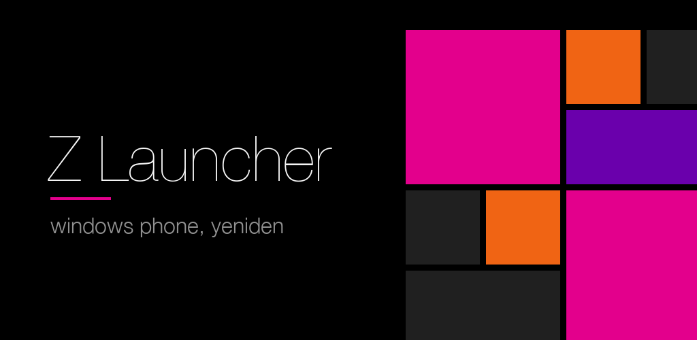
</p>

<p align="center"><strong>Metro arayüzü, yeniden.</strong><br>
Windows Phone'u özleyenler için sıfırdan yazılmış bir Android başlatıcı: canlı karolar, hub'lar, turnike animasyonları ve Zune'un o ince yazısı.</p>

<p align="center">
  <a href="https://serkantkn.github.io/Z-Launcher/">tanıtım sitesi</a> · <a href="#english">English below</a>
</p>

<p align="center">
  
  
  
  
  
</p>

<p align="center">
  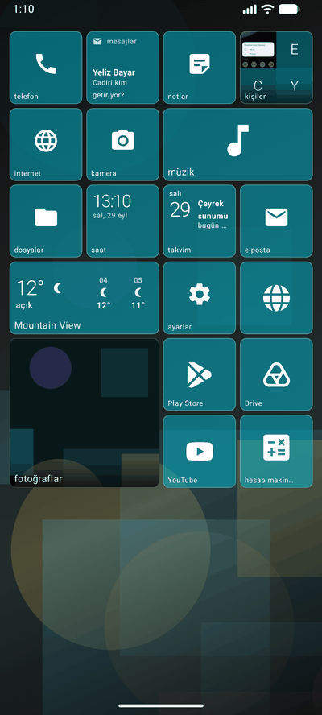
  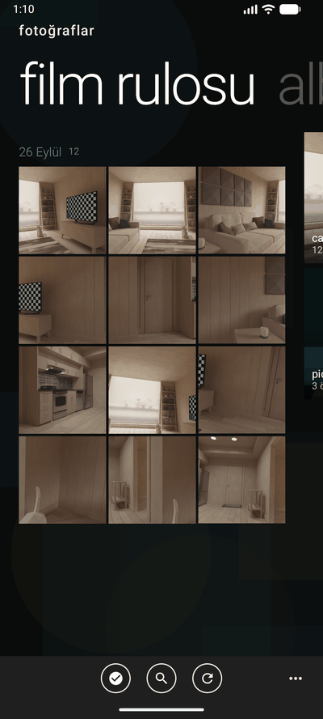
  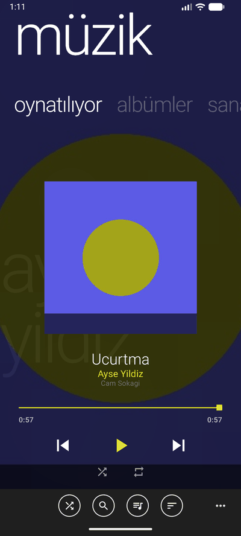
  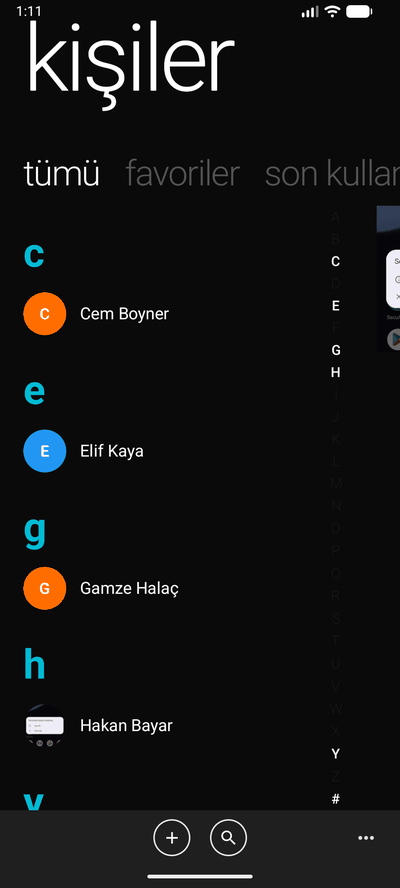
  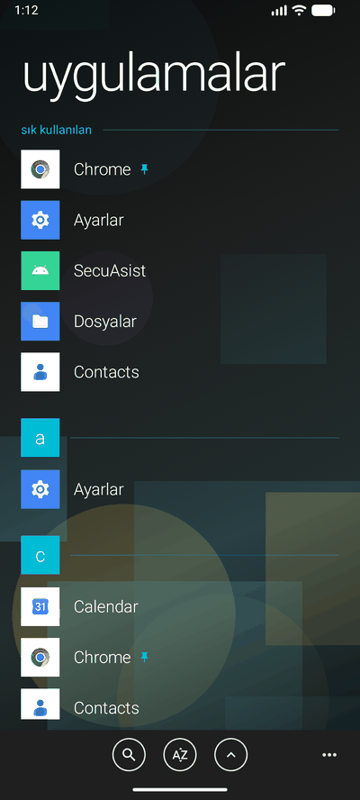
</p>

---

## Neden

Windows Phone'un arayüzü gitti; onu seven bir avuç insan kaldı. Z Launcher o arayüzü taklit etmiyor,
**yeniden yapıyor**: karoların dönüşünden bir hub'a girerken karoların turnike gibi savrulmasına,
klasör adının listeden kalkıp sayfanın başlığı olmasına kadar. Bugünün Android'inde, bugünün
telefonlarında çalışıyor — ve hiçbir şeyi hiçbir yere göndermiyor.

<p align="center">
  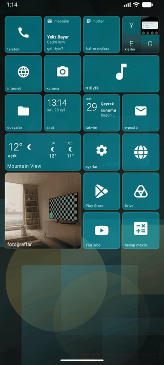
  &nbsp;&nbsp;
  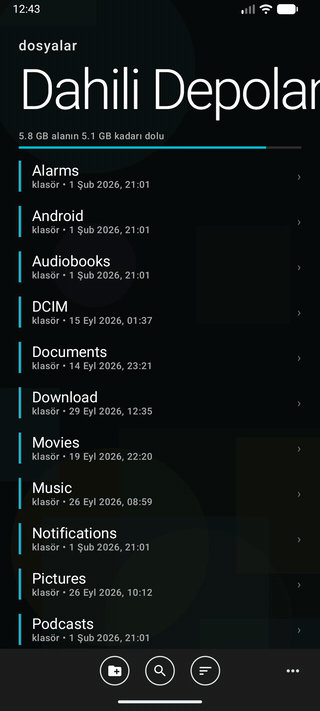
</p>
<p align="center"><sub>Solda: bir hub'a giriş ve çıkış. Sağda: dosyalar hub'ında klasöre giriş ve çıkış.</sub></p>

## Başlangıç ekranı

- **Canlı karolar.** Saat, takvim, mesajlar, kişiler, hava durumu ve müzik karoları kendiliğinden döner;
  kaydırma ya da çevirme hareketi seçilir, karo başına da ayarlanabilir.
- **Dört boyut.** Küçük, orta, geniş, büyük. Sürükle, sırala, üst üste bırakıp klasör yap.
- **Her şey sabitlenir.** Uygulama, kişi, konuşma, albüm, plak, not, web sayfası.
- **Karo başına kişiselleştirme.** Renk, ad, simge (Windows Phone glifleri, ikon paketi ya da kendi resmin),
  simge boyutu, karoyu dolduran resim, animasyon, bildirim, şeffaflık ve yazı rengi — hepsi tek karo için,
  tek dokunuşla sıfırlanabilir.
- **Hub yerine uygulama.** İstersen "internet" karosu Chrome'u açsın; her hub istediğin uygulamaya yönlendirilebilir.
- **Üç düzen.** Windows Phone panosu, Zune tarzı hub listesi ya da Windows 8'in yatay panosu (tablet).
- **Çalışan hub'lar.** Home tuşuyla çıktığın hub arka planda kalır; panonun altında, Home'a çift basınca
  açılan görev değiştiricide ya da iki parmakla yukarı çekince bölünen ekranda geri gelir.

<p align="center">
  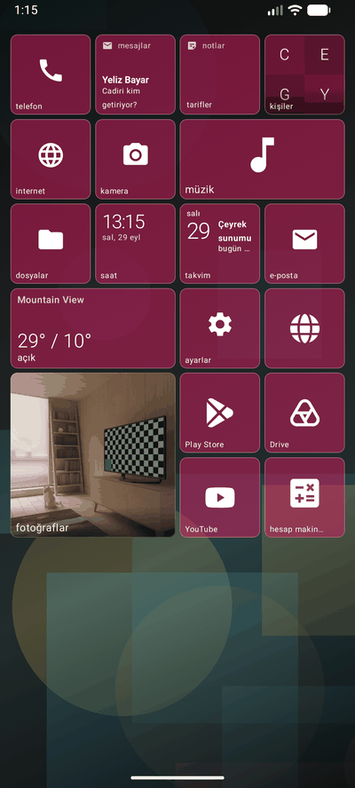
  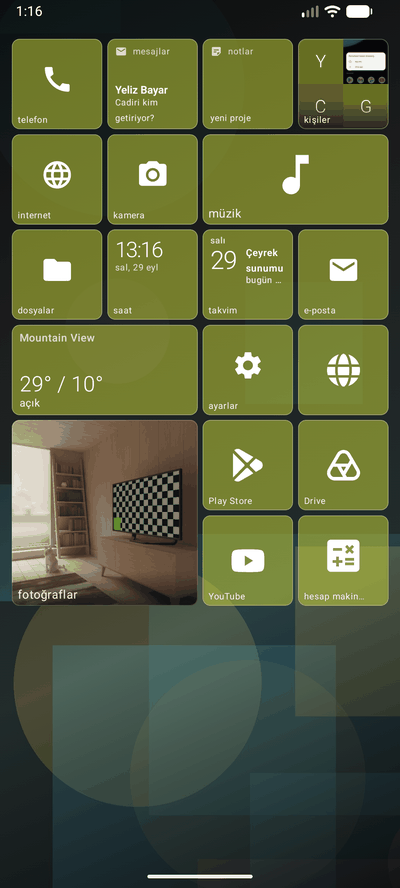
  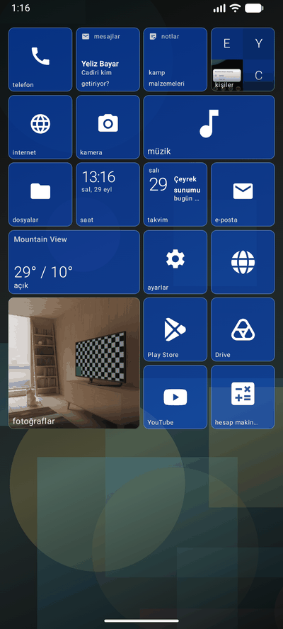
  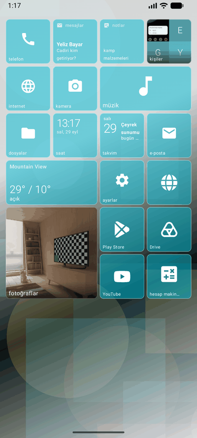
  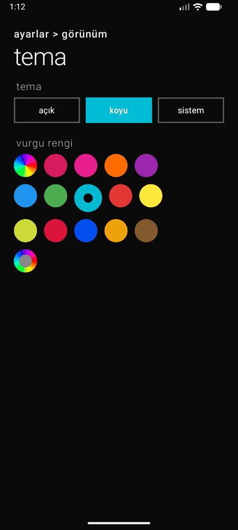
</p>
<p align="center"><sub>On dört vurgu rengi, özel renk, koyu ve açık tema, saydamlık, köşe biçimi, karo aralığı.</sub></p>

## Hub'lar

Hepsi uygulamanın içinde, hepsi aynı dilde yazılmış:

| | |
|---|---|
| **telefon** | arama, çağrı kaydı, hızlı arama, telesekreter |
| **mesajlar** | SMS ve MMS, konuşma sabitleme, hızlı yanıt |
| **kişiler** | gruplar, mükerrer kayıt birleştirme, kişi karoları |
| **fotoğraflar** | film rulosu, albümler, video, düzenleyici, favoriler |
| **müzik** | yerel kitaplık, çalma listeleri, şarkı sözleri, albüm kapakları |
| **internet** | sekmeler, yer imleri, indirmeler, gizli gezinme |
| **e-posta** | IMAP/SMTP, birden çok hesap, Google ile oturum açma |
| **notlar** | kontrol listeleri, resim ve ses, kilitli notlar |
| **dosyalar** | kopyala · taşı · yapıştır · yeniden adlandır · sil · ayrıntılar; metin, resim, ses, video ve PDF'i kendi açar; bulut sürücüler |
| **sosyal** | seçtiğin uygulamaların mesajları tek akışta *(Pro)* |
| **saat · takvim · hava durumu · hesap makinesi · kamera** | her biri kendi canlı karosuyla |

Ve **uygulamalar** listesi: sık kullanılanlar başta, harfler kaydırırken üstte sabit kalır, basılı tutunca
beyaz bir çizgi menüye açılır.

<p align="center">
  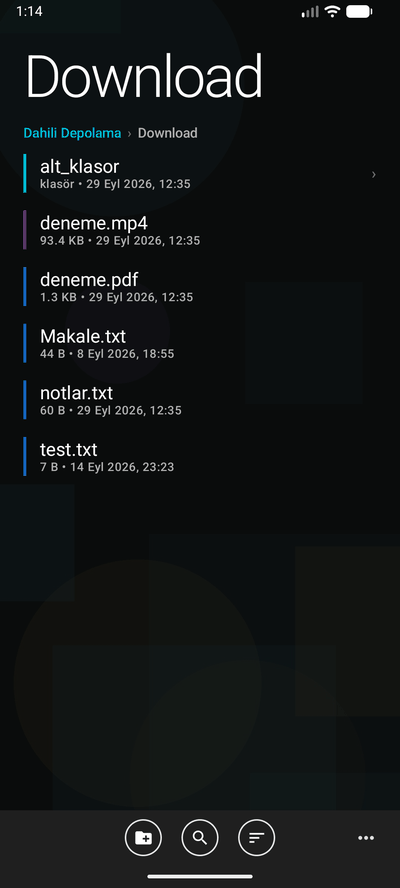
</p>

## Ayrıca

- Windows Phone klavyesi ve tahmin çubuğu *(Pro)*
- Ses çubuğundan bildirim şeridine kadar WP arayüzü
- Türkçe ve İngilizce
- Tablet düzeni ve bölünmüş ekran

## Gizlilik

Sunucu yok. Reklam, analiz, kullanıcı hesabı yok. Kişilerin, mesajların ve fotoğrafların telefonda kalır.
Telefondan yalnızca hava durumu, şarkı sözü ve arama önerisi istekleri çıkar — o da o özelliği kullandığında
ve kimliğin eklenmeden. E-posta şifreleri ve kilitli notlar cihazda şifrelenir.
Ayrıntılar: [PRIVACY.md](PRIVACY.md) · [English](PRIVACY.en.md) · [web](https://serkantkn.github.io/Z-Launcher/gizlilik.html).

## Derlemek

```bash
./gradlew assembleFreeDebug
```

İki ürün çeşidi var: `free` ve `premium` (Pro). Pro, vurgu renklerinin tamamını, özel duvar kağıdını,
sosyal hub'ı ve klavyeyi açar; kod aynıdır, `BuildConfig.IS_PREMIUM` ile ayrılır.
Android Studio'nun güncel sürümü, JDK 17+ ve minSdk 28 (Android 9) yeter.

Birim testleri:

```bash
./gradlew testFreeDebugUnitTest
```

Proje, kullanıcı arayüzünün tamamı Jetpack Compose olacak şekilde Kotlin'le yazıldı; `app/src/main/java/com/serkantkn/zunelauncher`
altında `data` (model, DataStore, depolar), `ui/screens/<hub>` (her hub kendi ekranı ve ViewModel'iyle), `ui/components`
(karolar, diyaloglar, pivot) ve `ui/animation` (turnike, menteşe, başlık zıplaması) klasörleri var.

## Mağaza ve yayın

`STORE.md` mağaza metinlerini, `store/` görselleri ve tanıtım videosunu, `PLAY.md` Play Console beyanlarını,
`KEYSTORE.md` imzalama anahtarını anlatır. Gizlilik politikası GitHub Pages'ten yayımlanır: [`docs/`](docs/).

## Teşekkür

Karo glifleri Microsoft'un [Fluent UI System Icons](https://github.com/microsoft/fluentui-system-icons) setinden
(MIT, `third_party/`). Windows Phone, Zune ve Metro Microsoft'un markalarıdır; bu proje Microsoft'la ilgili değildir.

---

<a name="english"></a>
## English

**Metro, again.** A launcher written from scratch for anyone who misses Windows Phone: live tiles, hubs,
turnstile animations and Zune's thin type, running on today's Android — and sending nothing anywhere.

- **Start screen.** Small, medium, wide and large tiles; live tiles that turn by themselves; folders; pin apps,
  people, conversations, albums, records, notes and web pages. Every tile can be given its own colour, name,
  icon, picture, animation, transparency and ink, and reset with one tap. Any hub's tile can open another
  app instead. Three layouts: the Windows Phone board, a Zune-style list, the Windows 8 board on tablets.
- **Hubs, all in-app.** Phone, Messaging, People, Pictures, Music, Internet, Email, Notes, Files (copy, cut,
  paste, rename, delete, details; opens text, pictures, sound, video and PDF itself; cloud drives), Social,
  Clock, Calendar, Weather, Calculator, Camera. Hubs left with Home keep running and come back from the
  running-hubs strip, a double press of Home, or a two-finger swipe that splits the screen.
- **Looks.** Fourteen accent colours and a custom one, dark and light themes, tile transparency, corner
  style and spacing. The Windows Phone keyboard *(Pro)*.
- **Privacy.** No server, no ads, no analytics, no account. Only weather, lyrics and search suggestions
  ever leave the phone, and only when you use them. See [PRIVACY.en.md](PRIVACY.en.md).

Build with `./gradlew assembleFreeDebug` (flavours `free` and `premium`; minSdk 28). Written in Kotlin,
all of the UI in Jetpack Compose. Tile glyphs are Microsoft's Fluent UI System Icons (MIT). Windows Phone,
Zune and Metro are Microsoft's trademarks; this project is not affiliated with Microsoft.
